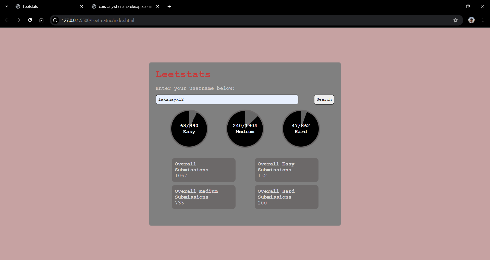

# Leetstats

Leetstats is a web app that fetches and displays your LeetCode problem solving statistics visually through circular progress bars and detailed submission cards.

## Features

- Validate LeetCode username input
- Fetch real-time stats using the LeetCode GraphQL API
- Display proportionate progress circles for Easy, Medium, and Hard problems
- Show submission counts in cards below the progress graphs
- Responsive and clean user interface

## Getting Started

### Prerequisites

- Modern web browser with JavaScript enabled
- Internet connection (for API calls and CORS proxy)

### Running Locally

1. Clone or download the repository.
2. Open `index.html` in your browser (recommended to serve via a local server for CORS).
3. Enter your LeetCode username.
4. Click **Search** to see your stats.

### Project Structure

- `index.html` – The main HTML structure with input fields and containers for results.
- `style.css` – Styling for layout, circular progress bars, and cards.
- `script.js` – JavaScript code handling input validation, API requests, data processing, and UI updates.

### Dependencies

- Uses [cors-anywhere](https://cors-anywhere.herokuapp.com/) proxy service to bypass CORS restrictions.

## Screenshots

  
*Leetstats interface showing progress circles and submission stats.*

## Usage

- Enter your LeetCode username carefully.
- View progress on problems solved for each difficulty.
- Submission cards summarize your overall and difficulty-specific submissions.

## Notes

- The CORS proxy might require enabling or temporary access via its website.
- Ensure your username matches LeetCode's username format (alphanumeric, underscores, hyphens less than 16 chars).

## License

This project is open-source and free to use.

---

Thank you for using Leetstats to track your coding progress on LeetCode!

